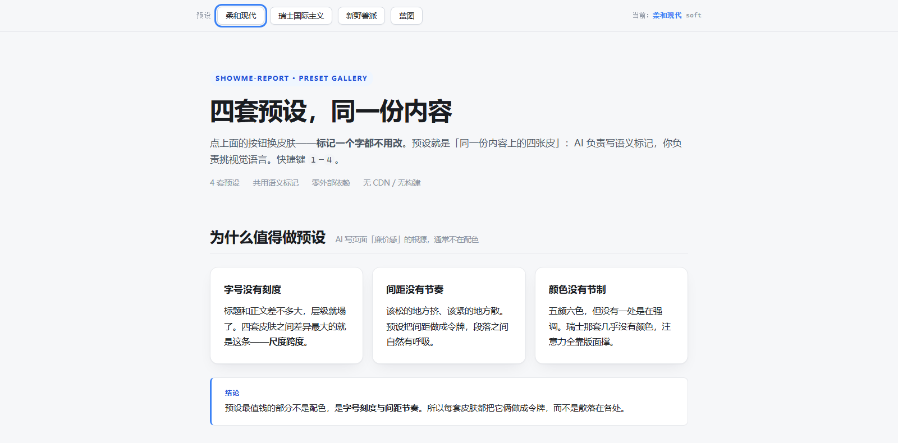
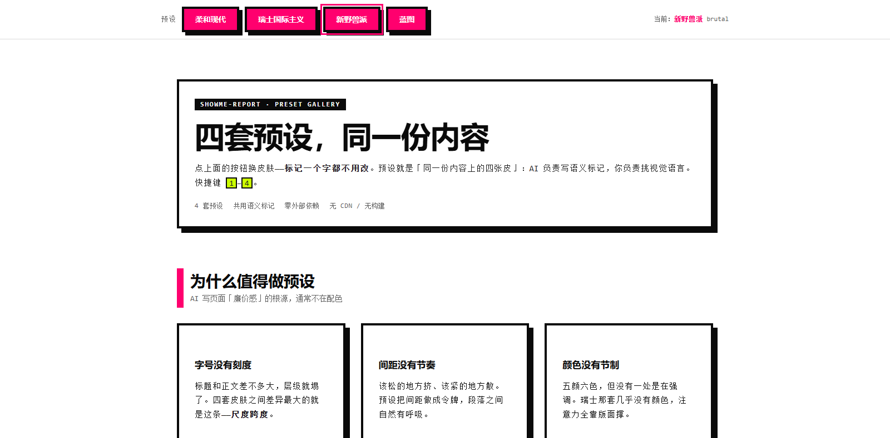
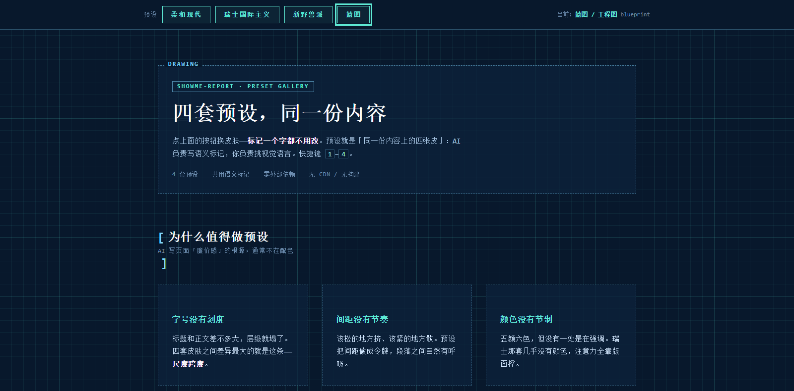
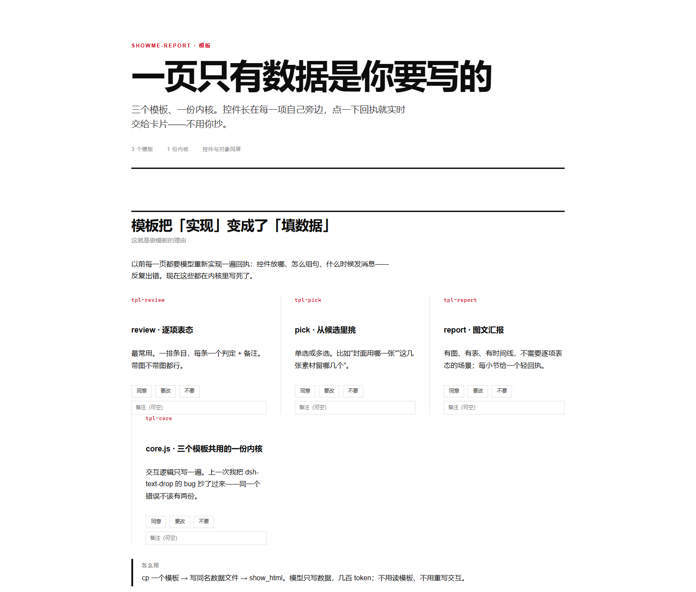

# dsh-showme-html · 把成果摊开给你看

> **English**: A DeepSeek Harness plugin that renders a workspace HTML page inside the conversation as a card, and hands the user's per-item verdicts back to the agent as one line per item.


[](LICENSE)


> 让 agent 把成果摊开给你看，让你点着回话。

DSH（DeepSeek Harness）插件。给 agent 一个快捷入口：把工作区里写好的 HTML 页直接展示在对话里；
并让用户在页面上"点名 + 表态"产生的文本，**一行一条**地回到 agent 手里。

仓库：<https://github.com/liceses/dsh-showme-html>


*图 · 一次真实交付（示例页 `examples/promo.html`）—— 一屏里三件事都拍到了：**卡片头部**是 `show_html` 徽章、标题、体积，以及 刷新 / 全屏 / 浏览器打开；**页面本体**是瑞士国际主义皮肤，顶部那排还能现场换皮肤（换的只是那一个 `<link>`）；**底部反馈条**里的 `pain-markdown 补充` 就是用户在页面上点选之后，由**页面替他组织好**的一行回执 —— 接着按「填入输入框」，这句话就追加进了对话输入框。*

---

## 快速开始

### 一、装

```powershell
# 从 GitHub 直接装
dsh plugin --profile web add "github:liceses/dsh-showme-html"

# 或者从本地源码目录装（开发时用，改完源码好追踪）
dsh plugin --profile web add "link:<本目录绝对路径>"

# 两种方式都需要重启 dsh web 才生效（宿主半区在启动时装载）
```

配套的 `showme-report` skill 用一个目录联接挂进去，**热发现、不用重启**：

```powershell
New-Item -ItemType Junction -Path "$env:USERPROFILE\.dsh\skills\showme-report" `
         -Target "<本目录绝对路径>\skill\showme-report"
```

> **这个联接是可选的。** 插件在启动时会检查它：**在，就什么都不做**（让文件系统 provider
> 继续提供"改完 SKILL.md 立刻生效"的热发现）；**不在，就用 `ctx.skills.register()`
> 运行时注册兜底**，保证装了这个插件就有这个 skill。
>
> 之所以做这层兜底：联接在仓库之外，任何一次清理都可能把它悄悄弄丢，
> 而症状只是"模型不再加载 skill"，从外面完全看不出来。想知道它还在不在：

```powershell
npm run doctor          # 一体检：资产 / skill 投递 / profile 装配 / 运行中的路由
```

> 没有构建步骤：`lib/` 就是成品，仓库里没有"编译产物"这一层。

### 二、用：一次完整的使用长这样

```
1. agent 写完东西，按共用语义标记写一页 HTML，挑一套皮肤：

     <link rel="stylesheet" href="presets/swiss.css">

2. 调一次工具：

     show_html({ path: ".dsh/showme/review.html",
                 title: "设计评审",
                 note: "挑一个变体" })

3. 卡片直接出现在对话里 —— 不用去文件树里翻、不用切浏览器。
   卡片头部：刷新 / 全屏 / 在浏览器打开原文件。

4. 你在页面上点选、写备注；页面实时把它组织成一行一条的文本。

5. 点「填入输入框」—— 追加到你已有的内容后面。或者直接选中复制。
```

**不新增任何常驻服务**：宿主就是 DSH 已经在跑的那个 web server；反馈在浏览器内完成。
页面默认落在 `.dsh/showme/`（隐藏目录，不污染源码树、不进 git）。

---

## 目录

| 想了解 | 看这里 |
| --- | --- |
| 为什么需要它 | [它解决什么](#why) |
| 它有哪些能力 | [核心能力](#features) |
| 四套皮肤长什么样 | [四套预设样式](#presets) |
| 想少写点代码 | [模板：三份骨架](#templates) |
| 那个 skill 和插件什么关系 | [`showme-report` 与 DSH 的关系](#skill) |
| 它到底怎么实现的 | [工作原理](#how) |
| 页面里的脚本能干什么 | [安全模型](#security) |
| 有什么坑 | [已知限制](#limits) |
| 想改代码 | [仓库结构](#layout) · [开发](#dev) |
| 许可 | [许可](#license) |

---

<a id="why"></a>
## 它解决什么

### 一、读完一屏 Markdown，你还是"没看见"

agent 干完一件大事，甩给你 200 行 Markdown。你读完了，但你没有**看见**那个东西。

十几个变体的像素级差异、时间线、两种方案并排、改前改后对比——这些本质上是**空间与视觉**的信息。
压成文字就是降维，你只能在自己脑子里把它重新拼回一张图。

> 判断标准很简单：**这件事你是"读"更省事，还是"看"更省事。**
> 前者继续用 Markdown；后者交给这一页。

### 二、AI 产出了十几个变体，而你叫不出它们的名字

这是最初做出这个插件的动机，原话是：

> "我有很多 AI 生成的图片或者网页组件，我没办法一个一个准确地叫出它们的名字，
> 他们的名字是 AI 可以给出的。我希望我选择哪一个，就可以得到它的名称用来和 AI 交流，
> 还能表达我的意见，比如说同意，或者要某个组件的风格。"

于是对话常常变成——"把第三个、就是那个带渐变的那张再改一下"。而你嘴里的"第三个"，
和 agent 理解的"第三个"是不是同一个东西，全凭运气。

**这个插件给每样东西一个稳定、唯一、页面上看得见的名字**（`hero-banner-v3`、`f2`、`shot-07`）。
指认从此没有歧义。

### 三、反馈回去的路上，意思总会走样

读页面 → 组织语言 → 打字 → agent 猜你指的是哪一项。这条路上每一步都在丢信息。

这里把它压成 **点两下 → 页面替你写好一句话 → 粘回去**：

```
同意 hero-banner-v3（第 3 版），按它的风格继续；不要 stats-panel-v1（颜色太灰）。
```

这句话放进一个能鼠标选中、能 Ctrl+C 的 textarea 里——**这是唯一永远可用的回传方式**。
页面还会顺手把它 `postMessage` 给卡片，于是你能一键**追加**进输入框（不覆盖你已经写了一半的草稿）。

### 四、AI 写出来的页面有"廉价感"

标题和正文一样大、行高挤成一团、颜色随机、还得连 CDN 才敢用。

插件附了**四套预设样式**，每套都把**字号刻度与间距节奏**做成设计令牌——
那才是"好看"的真正来源，不是配色。四套**吃同一套语义标记**，所以换皮肤一个字都不用改标记。

---

<a id="features"></a>
## 核心能力

| | |
|---|---|
| **工具 `show_html`** | agent 调一下，就等于"把这一页给用户看"。参数只有 `path` / `title` / `note`；**不收 HTML 正文**——正文进参数会白烧一遍 token，而且页面会被反复改，留成文件才可迭代、可留档。 |
| **镜像读路由** | `GET /api/showme/raw/<sessionId>/<工作区相对路径>`。按工作区目录结构分发，于是页面里的**相对引用天然可用**（``、预设 CSS、下级页），**同一个地址就是「在浏览器打开原文件」**。 |
| **对话内卡片** | 标题 / 源文件路径 / 刷新 / 全屏 / 浏览器打开；**非可见的卡片不持有活 iframe**（历史里几十张卡片不会把会话拖卡）。 |
| **画面内全屏** | 走框架级浮层，Esc 退出回到原位、滚动位置不丢。 |
| **反馈两条路** | ① 页面 `postMessage` 给卡片 → 一键填入输入框；② 页面 `POST /api/showme/feedback` 追加到 `<工作区>/.dsh/showme/inbox.jsonl`。都不实现也不影响——页面里的可选中文本本来就是通用交换格式。 |
| **四套预设样式** | 见下。 |
| **回执体检 + 引用体检** | `show_html` 展示前扫一遍页面：**缺可点名的 id**、**缺 `postMessage` 回传**（只给"可复制文本"不算），或**引用了不存在的相对资源**时，把提醒**随工具结果**交回给模型。实测过 skill 被加载、被读，却没被照做——工具结果是这条链路上唯一不依赖模型自觉的通道。 |
| **skill `showme-report`** | 教 agent 怎么写这一页：挑皮肤、回执契约、交换格式、沙箱坑。**不含版式要求**——版式仍然是 agent 的活。 |

---

<a id="presets"></a>
## 四套预设样式

放在插件包的 `styles/`，**宿主在你第一次展示页面时自动落到工作区**
`<工作区>/.dsh/showme/presets/`（**create-only**：已存在的不覆盖，所以你可以自己改）。

页面引用就是一行：`<link rel="stylesheet" href="presets/soft.css">`

| slug | 名字 | 什么时候用 |
|---|---|---|
| `soft` | 柔和现代 | **默认**。通用汇报、进展同步、长时间阅读 |
| `swiss` | 瑞士国际主义 | 编辑部长文、结论多的分析、要权威感 |
| `brutal` | 新野兽派 | 设计评审、多变体挑选、强指认感 |
| `blueprint` | 蓝图 / 工程图 | 架构、数据流、时序、依赖关系 |


*图 · 真实示例页 `examples/preset-gallery.html`（本地渲染，柔和现代 = 默认皮肤）—— 顶部那排就是换肤开关，页面上半部分是内容。*

同一份标记，只换那个 `<link>` 指向的文件：


*图 · 同一页、同一份标记，皮肤换成 `brutal`（新野兽派）—— 黑粗边框、硬阴影、无圆角、品红强调。*


*图 · 再换成 `blueprint`（蓝图 / 工程图）—— 深蓝底 + 网格、青色线条、全等宽、虚线框。标记仍然一个字没动。*

**四套吃同一套语义标记**（`.page` `.masthead` `.kicker` `.lead` `.section` `.card` `.cols`
`.stat`/`.num` `.chips`/`.chip` `.btn` `.table` `.callout` `.evidence` `.timeline` `.kv`
`.code` `.muted` `.mark` `.rule`）——**换皮肤不用改标记**。这也是「可切换预览器」能成立的前提。

- `styles/index.json` 是清单，里面那行 `default` 就是默认皮肤，**改一行即可**。
- `soft` / `swiss` 跟随系统明暗；`brutal` 固定亮色；`blueprint` 固定暗色。
- **自包含**：无 `@import`、无外链字体、无 `url()`、无 CDN。断网也完整。
- 想用 [StyleKit](https://www.stylekit.top/zh/styles) 目录里的其他风格（148 种）？
  它的 `tokens` / `components` 是 Tailwind 类名与 React JSX，**单文件静态页直接用不了**；
  把它当**约束清单**（`colors` / `doList` / `dontList` / `philosophy`）自己翻译成原生 CSS。
  具体路径写在 `skill/showme-report/SKILL.md` §2.4。
- **预设不是强制的**：要评审/复刻某个具体系统的视觉时（比如评审 DSH 插件自己的设置页），
  用那个系统的官方调色板才对——这时**不要写 `<link>`**，否则两套视觉会叠在一起。
  理由写在 skill §2.3。

---

<a id="templates"></a>
## 模板：三份骨架

skill 用文字规定"回执怎么做"，模型每次都重新实现一遍，于是**控件位置、组句、通道时机反复出错**。
模板把"实现"变成"填数据"。

宿主在你第一次展示页面时把骨架落到 `.dsh/showme/templates/`（create-only）：

| 骨架 | 形状 | 什么时候用 |
|---|---|---|
| `review.html` | 逐项表态 | 一排条目，每条一个判定 + 备注。带图不带图都行。**最常用** |
| `pick.html` | 候选挑选 | 单选 / 多选。封面选哪张、这几张素材留哪几个 |
| `report.html` | 图文汇报 | 有图 / 表 / 时间线、不需要逐项表态；每小节一个轻回执 |


*图 · 真实示例页 `examples/template-demo.html`（数据来自同目录的 `template-demo.data.js`，皮肤由数据文件里的 `skin: 'swiss'` 指定）—— 每个可点名的条目都带 `同意 / 要改 / 不要` 与备注框，控件就长在它指的那样东西旁边。*

**一页 = 外壳 + 内核 + 数据**，你只写最后那个：

```
templates/<shape>.html   外壳（**直接 write，别 cp** —— 见下）
templates/core.js        内核：渲染与交互全在这里，三个形状共用一份，别读、别改
<名字>.html              你写的页面
<名字>.data.js           ← 你唯一要写的，内容就是 window.SHOWME = { … }
```

> ⚠️ **`templates/` 在新工作区里还不存在。** 宿主是在**第一次 `show_html`** 时才创建它的，
> 而 agent 需要外壳的动作排在流程**开头**——所以第一步 `cp` 必然失败。
> 落点已改成：**先落地、后校验**，直接 `write` 这个外壳就行：

```html
<!doctype html><html lang="zh-CN"><head><meta charset="utf-8">
<meta name="viewport" content="width=device-width,initial-scale=1"><title>—</title>
<link id="skin" rel="stylesheet" href="presets/soft.css"></head><body>
<div class="page"><div id="sm-masthead"></div><div id="sm-content"></div><div id="sm-receipt"></div></div>
<script>window.SHOWME_SHAPE = 'review'</script>
<script src="templates/core.js"></script></body></html>
```

`'review'` 换成 `'pick'` / `'report'` 就是另外两个形状。你引用的 `core.js` 与 `presets/*.css`
会在展示那一刻已经就位，浏览器取它们时一定存在。

**想先把资产催出来**（例如要读 `templates/README.md`）：**随便调一次 `show_html`**，
哪怕路径不存在——落地排在**校验之前**，失败也会跑。

**文件名必须同名**：`mypage.html` ↔ `mypage.data.js`（内核按页面文件名推导）。

> 📖 **数据字段表在 [`templates/README.md`](templates/README.md)**——三个形状、全部字段、
> 10 种内容块、常见错误，4KB 一份。它也会落到 `.dsh/showme/templates/README.md`。
>
> **不要读 `core.js`**：那是实现（20KB），字段表那一份就够了。
> 实测过：一个会话为了搞清"它认哪些块类型"，把内核通读了一遍（≈5–6 千 token），
> 而答案就是那张 10 行的块类型表。`test/templates.test.mjs` 里有**一条专门盯着
> 这份文档与内核一致性的测试**——内核加了块类型而 README 没跟上，测试会红。

- **为什么最省**：只写数据（几百 token）。老写法每次从头写一个 10KB 页面 ≈ 3–4 千 token，
  而且每次都可能把回执写错。
- **为什么数据走 `<script src>` 而不是 `fetch`**：展示页在 sandbox 的不透明源里，
  `fetch` 同源资源会被当成跨域请求拦掉（我们不发 CORS 头）。经典 script 不受这条限制。
- **内核只写一份**：三个形状共用 `core.js`。这一路我已经被"抄来抄去抄出 bug"咬过一次
  （照抄 `dsh-text-drop` 的 `props.input`，而那个属性根本不存在），不想再来第二次。
- **模板是可选骨架，不是形式强制**：架构图、时序图、长文分析不是"条目式"的形状，
  那就自己写——§3 的回执契约、§4 的通道、§5 的沙箱约束照样适用。

`examples/` 里的 `template-demo.html` 是一个真实用例：外壳 **567 字节**（就是上面那段），内容全在数据文件里。

---

<a id="skill"></a>
## `showme-report` 与 DSH 的关系

这个仓库里有两样东西，**它们是同一件事的两半**：

| | 是什么 | 住在哪 |
|---|---|---|
| 插件本体 | 工具 `show_html` + 镜像读路由 + 对话内卡片 + 四套预设 + 三份模板 | `lib/` `styles/` `templates/` |
| skill `showme-report` | **教 agent 怎么写这一页**：功能契约、回执交换格式、沙箱坑 | `skill/showme-report/SKILL.md` |

**DSH 的 skill 是"按需加载的说明书"**：平时不进上下文，模型判断该用时才读进来。
所以这个 skill 不在 `lib/` 里，也不该在——它是给模型看的，不是给运行时跑的。

投递走两条路，**刻意不同时提供同名 skill**：

| 情况 | 插件做什么 | 结果 |
|---|---|---|
| `$DSH_HOME/skills/showme-report/SKILL.md` **存在**（你挂了目录联接） | 什么都不做 | `skipped-linked` —— 保留文件系统 provider 的"改完 SKILL.md 立刻生效"热发现 |
| 上面那个**不在** | `ctx.skills.register({ name, description, whenToUse, source: 'runtime', content, resourceBase })` | `registered` —— 保证"装了这个插件就有这个 skill" |
| 拿不到 `skills` 服务，或缺 frontmatter | 记一笔，不拖垮插件本体 | `unavailable` |

**兜底不是锦上添花，是必需**：联接在仓库之外，任何一次清理都可能把它悄悄弄丢，
而症状只是"模型不再加载 skill"——从外面完全看不出来。这个仓库**真的被咬过一次**。
`npm run doctor` 的第 2 段就是专门盯这一环的（它还会比对联接两侧内容是否一致）。

另外，`show_html` 的**工具描述本身**就写着"写页面之前先加载 `showme-report`"，
而**工具结果里的 `hint`** 是兜底中的兜底：页面缺回执时，提醒随工具结果直接回到模型眼前——
这条通道不依赖模型自觉去读 skill。

---

<a id="how"></a>
## 工作原理

一次 `show_html` 的时序（`lib/index.js`）：

```
① 工具被调用，拿到 path / title / note
② 先落资产：styles/* → <工作区>/.dsh/showme/presets/，templates/* → .dsh/showme/templates/
   （create-only；**排在所有校验之前**，所以"随便调一次"也能把资产催出来）
③ 再校验：扩展名必须是 .html/.htm → 路径必须在工作区内（realpath 双重校验）→ 单页 ≤ 8 MiB
④ 体检：扫页面本体 + 它引用的本地脚本 → 缺回执 / 缺 id / 引用不存在 → 拼成 hint
⑤ 返回 { path, bytes, url, hint }，url 由**宿主**算好（逐段编码，保留目录结构）
⑥ 卡片拿到 url，挂 iframe；hint 由 output.render 拼进工具结果给模型看
```

**为什么按目录结构镜像分发**：写页面的 agent 不需要知道任何 URL 前缀。
``、同目录的 `.css` / `.js`、下级 `shot-f3.html` —— 照原样写就行。
代价是多一条路由，收益是"页面可以像本地文件一样互相引用"，而且**同一个地址就是「在浏览器打开原文件」**。

**路由契约**：

| 路由 | 方法 | 说明 |
|---|---|---|
| `/api/showme/raw/<sessionId>/<工作区相对路径>` | GET | 按工作区目录结构分发；27 种扩展名的 MIME 白名单，表外 415；HTML 响应额外带 CSP `sandbox` |
| `/api/showme/feedback` | POST | 追加一行到 `<工作区>/.dsh/showme/inbox.jsonl`（上限 256 KiB） |

**反馈为什么有两条路，而且都"可以不做"**：

1. **`postMessage` → 卡片**（默认路径）：页面把汇总文本发给父页面，卡片显示它并给一个
   「填入输入框」按钮。这条最顺——它**追加**而不是覆盖你已经写了一半的草稿。
2. **`POST /api/showme/feedback` → 落盘**：页面自己直连宿主，追加进 `inbox.jsonl`，
   卡片显示"已落盘"。
3. **兜底**：页面里那段**能鼠标选中、能 Ctrl+C 的文本**。

第 3 条是"通用交换格式"：前两条都不实现，你也照样能把话带回来。
所以体检对第 1 条的判定是"缺 `postMessage` 回传就提醒"——**只给可复制文本不算**。

**资产是插件包里的原件，落地是 create-only**：`styles/index.json` 的 `default` 一行决定默认皮肤；
你在工作区里改过的副本不会被覆盖。想恢复原件，删掉工作区那份再调一次 `show_html` 即可。

---

<a id="security"></a>
## 安全模型（两层，刻意不同）

同一个地址，两种档位：

| | 卡片内（iframe） | 真浏览器新标签页 |
|---|---|---|
| 生效的 sandbox | iframe 属性 **∩** 响应头 CSP | 只有响应头 CSP |
| 脚本 | ✅ | ✅ |
| 表单 / 下载 / `alert` / 弹窗 | ❌ | ✅ |
| 能碰到 DSH 应用本身 | ❌（不透明源） | ❌（CSP `sandbox` 强制不透明源） |

所以卡片是**安全模式**，工具栏的「浏览器打开」是**逃生门**：功能完整，但依然读不到应用数据。

其余围栏：

- **回环围栏**：只服务 `127.0.0.1`/`::1` 且 Host 是回环的请求。
  ⚠️ **不要用 `Sec-Fetch-Site` 做判断——在这里它完全冗余，而且会咬自己两次**：
  展示页跑在 `sandbox` 的不透明源里，它加载自己的图片、嵌套页、页内 `<a href>` 跳转、
  以及自己的 `fetch`，**统统**被浏览器标成 `cross-site`，`Origin` 是字面量 `"null"`。
  真正管用的是**只收回环地址** + **Host 必须是回环** + **一个 CORS 头都不发**
  （跨站方发起了也只会拿到不透明响应，拿不走工作区文件）。
- **工作区根 + realpath 双重校验**：`..`、编码穿越（`%2f` / `%5c`）、指向工作区外的软链接，一律 403。
- **扩展名白名单**：不在表里的一律 415。
- `X-Content-Type-Options: nosniff`、`Referrer-Policy: no-referrer`、`Cache-Control: no-store`。

---

<a id="limits"></a>
## 已知限制

- **不缓存**：每次刷新都重读文件（故意的——页面会被反复改）。
- **不做范围请求**：大视频文件会整个读进内存再发。
- **不做文件监听**：改完文件要按卡片上的「刷新」（自动刷新属于后续里程碑）。
- **页面在卡片里能力受限**：见上表；需要 `localStorage` / 表单 / 下载时请用「浏览器打开」。
- **不支持 `file://` 链接**：浏览器禁止从 http 页面跳到 `file://`，所以「在浏览器打开」走 HTTP 路由。
- 单页上限 8 MiB；反馈正文上限 256 KiB。
- **`ctx.get('sessions')` / `ctx.get('sessionQuery')` 在路由所在的插件上下文里取不到**
  （Inspect 把它们标注为 `optional`）。所以权威来源改成**工具执行时记下的「会话 → 工作区根」**，
  服务查询只作兜底；认不出来时错误信息会回报具体哪个服务缺了。
- **重写页面要记得换 `<link>`**：预设是外链的，页面本身不携带样式。

---

<a id="layout"></a>
## 仓库结构

```
lib/index.js          宿主半区：show_html 工具 + 镜像读路由 + 反馈落盘 + 预设落地
lib/client.js         浏览器半区：对话卡片 + 画面内全屏 + 输入框镜像（closure-factory）
styles/*.css          四套预设样式（插件资产，宿主动态落地到工作区）
styles/index.json     预设清单：一行 default 就是默认皮肤
templates/            三份骨架 + core.js（插件资产，同样动态落地）
skill/showme-report/  产品核心：功能契约 + 交换格式 + 沙箱坑
examples/             示例页源码（页面冒烟测试的夹具）
test/                 离线验收：宿主 / 客户端 / 预设 / 模板 / 页面 五组
docs/                 需求演进与定稿方案
```

`.dsh/` 不进仓库——那是 DSH 在本工作区里的运行痕迹（展示副本、预设与模板的落地副本、反馈信箱）。

---

<a id="dev"></a>
## 开发

```powershell
npm test                # 222 项离线断言：宿主 85 / 客户端 33 / 预设 38 / 模板 29 / 页面 37

npm run doctor          # 装机体检：资产 / skill 投递 / profile 装配 / 运行中的路由

# 装配是否真的生效 —— 对着运行中的 3080 打真实请求
node test/live-probe.mjs <sessionId>
# sessionId 在 ~/.dsh/sessions/--<工作区路径转义>--/session-<uuid>/ 的目录名里
```

**零构建、零依赖**：`lib/index.js` 与 `lib/client.js` 就是成品，`package.json` 里没有任何
`dependencies` / `devDependencies` / `peerDependencies`。

- 宿主半区**不 import 任何 `@deepseek-ai/*`**。以 `link:` 安装时插件位于工作区外，
  Node 从真实路径向上找不到 profile 的 `node_modules`，外部 import 解析不了
  （同 profile 里 `dsh-text-drop` / `dsh-workspace-tree` 的宿主半区同样只用 node 内置模块）。
  因此工具定义按 `ToolDefinition` 契约手写：`{name, description, parameters}` +
  `output: {schema, render, presentationMeta?}` + `execute`，其中 `parameters` / `output.schema`
  都是**已编译好的 JSON Schema**。代价是参数校验要自己写，`execute` 里做了。
- 浏览器半区是 closure-factory 形态（`window.__ModuleLoader__.load({id, factory})`），
  平台模块（`react` 等）由加载器的模块表提供。

### 改完什么要做什么（**实测结论，没有捷径**）

| 改了 | 生效方式 |
|---|---|
| `skill/showme-report/**` | **热发现，什么都不用做** |
| `lib/index.js`（宿主半区） | **重启 `dsh web`**（改配置触发不了重载，实测三次都不行） |
| `lib/client.js`（浏览器半区） | 重启后由 client-modules 扫描；之后改它需要浏览器 **F5** |

### 写测试时的坑

桩必须照**真实契约**写。本项目就吃过一次：宿主测试的假 `sessions` 返回了 `{meta:{cwd}}`，
而真实 `Session` 只有 `header.cwd`，于是**离线 46 项全绿、线上全红**。
离线测试证明逻辑，`live-probe` 证明装配——两个都要。

---

<a id="license"></a>
## 许可

MIT © 2026 liceses —— 完整声明见仓库根目录的 [`LICENSE`](LICENSE)（`package.json` 的 `license` 字段同样是 `MIT`）。
